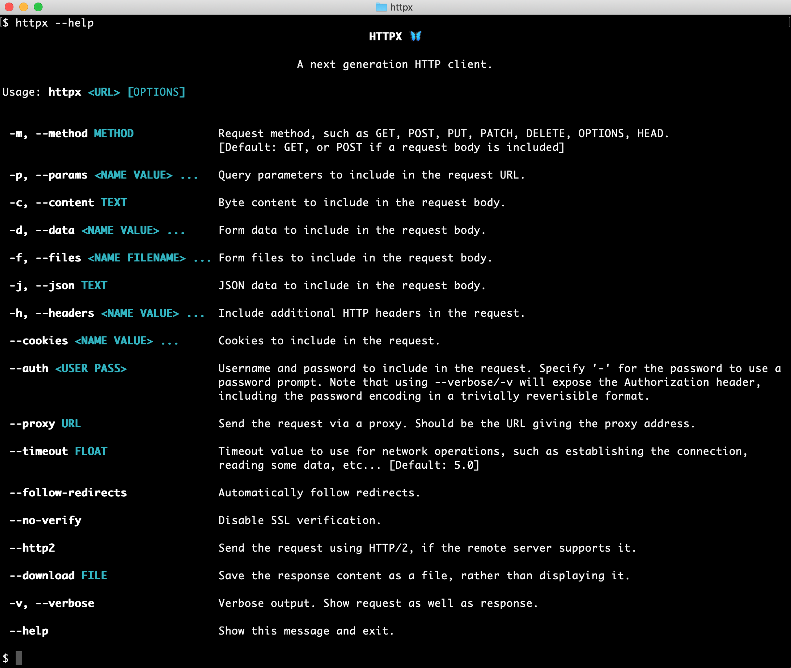

<p align="center">
  <a href="https://www.python-httpx.org/"></a>
</p>

<p align="center"><strong>HTTPX</strong> <em>- A next-generation HTTP client for Python.</em></p>

<p align="center">
<a href="https://github.com/encode/httpx/actions">
    
</a>
<a href="https://pypi.org/project/httpx/">
    
</a>
</p>

HTTPX is a fully featured HTTP client library for Python 3. It includes **an integrated
command line client**, has support for both **HTTP/1.1 and HTTP/2**, and provides both **sync
and async APIs**.

---

Install HTTPX using pip:

```shell
$ pip install httpx
```

Now, let's get started:

```pycon
>>> import httpx
>>> r = httpx.get('https://www.example.org/')
>>> r
<Response [200 OK]>
>>> r.status_code
200
>>> r.headers['content-type']
'text/html; charset=UTF-8'
>>> r.text
'<!doctype html>\n<html>\n<head>\n<title>Example Domain</title>...'
```

Or, using the command-line client.

```shell
$ pip install 'httpx[cli]'  # The command line client is an optional dependency.
```

Which now allows us to use HTTPX directly from the command-line...

<p align="center">
  
</p>

Sending a request...

<p align="center">
  
</p>

## Features

HTTPX builds on the well-established usability of `requests`, and gives you:

* A broadly [requests-compatible API](https://www.python-httpx.org/compatibility/).
* An integrated command-line client.
* HTTP/1.1 [and HTTP/2 support](https://www.python-httpx.org/http2/).
* Standard synchronous interface, but with [async support if you need it](https://www.python-httpx.org/async/).
* Ability to make requests directly to [WSGI applications](https://www.python-httpx.org/advanced/#calling-into-python-web-apps) or [ASGI applications](https://www.python-httpx.org/async/#calling-into-python-web-apps).
* Strict timeouts everywhere.
* Fully type annotated.
* 100% test coverage.

Plus all the standard features of `requests`...

* International Domains and URLs
* Keep-Alive & Connection Pooling
* Sessions with Cookie Persistence
* Browser-style SSL Verification
* Basic/Digest Authentication
* Elegant Key/Value Cookies
* Automatic Decompression
* Automatic Content Decoding
* Unicode Response Bodies
* Multipart File Uploads
* HTTP(S) Proxy Support
* Connection Timeouts
* Streaming Downloads
* .netrc Support
* Chunked Requests

## Installation

Install with pip:

```shell
$ pip install httpx
```

Or, to include the optional HTTP/2 support, use:

```shell
$ pip install httpx[http2]
```

HTTPX requires Python 3.8+.

## Documentation

Project documentation is available at [https://www.python-httpx.org/](https://www.python-httpx.org/).

For a run-through of all the basics, head over to the [QuickStart](https://www.python-httpx.org/quickstart/).

For more advanced topics, see the [Advanced Usage](https://www.python-httpx.org/advanced/) section, the [async support](https://www.python-httpx.org/async/) section, or the [HTTP/2](https://www.python-httpx.org/http2/) section.

The [Developer Interface](https://www.python-httpx.org/api/) provides a comprehensive API reference.

To find out about tools that integrate with HTTPX, see [Third Party Packages](https://www.python-httpx.org/third_party_packages/).

## Contribute

If you want to contribute with HTTPX check out the [Contributing Guide](https://www.python-httpx.org/contributing/) to learn how to start.

## Dependencies

The HTTPX project relies on these excellent libraries:

* `httpcore` - The underlying transport implementation for `httpx`.
  * `h11` - HTTP/1.1 support.
* `certifi` - SSL certificates.
* `idna` - Internationalized domain name support.
* `sniffio` - Async library autodetection.

As well as these optional installs:

* `h2` - HTTP/2 support. *(Optional, with `httpx[http2]`)*
* `socksio` - SOCKS proxy support. *(Optional, with `httpx[socks]`)*
* `rich` - Rich terminal support. *(Optional, with `httpx[cli]`)*
* `click` - Command line client support. *(Optional, with `httpx[cli]`)*
* `brotli` or `brotlicffi` - Decoding for "brotli" compressed responses. *(Optional, with `httpx[brotli]`)*

A huge amount of credit is due to `requests` for the API layout that
much of this work follows, as well as to `urllib3` for plenty of design
inspiration around the lower-level networking details.

---

<p align="center"><i>HTTPX is <a href="https://github.com/encode/httpx/blob/master/LICENSE.md">BSD licensed</a> code.<br/>Designed & crafted with care.</i><br/>&mdash; 🦋 &mdash;</p>
